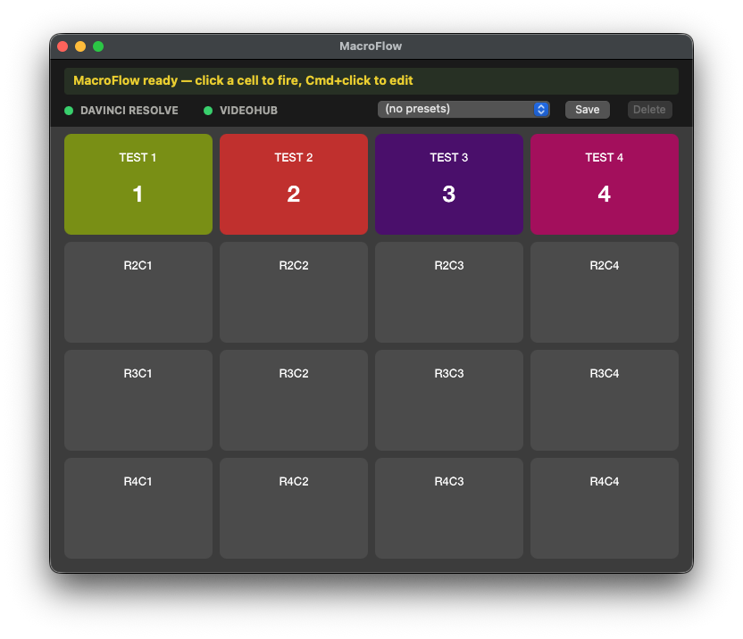
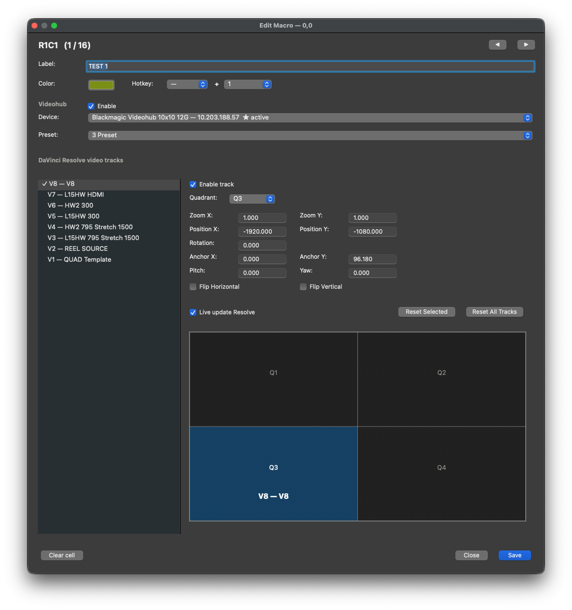
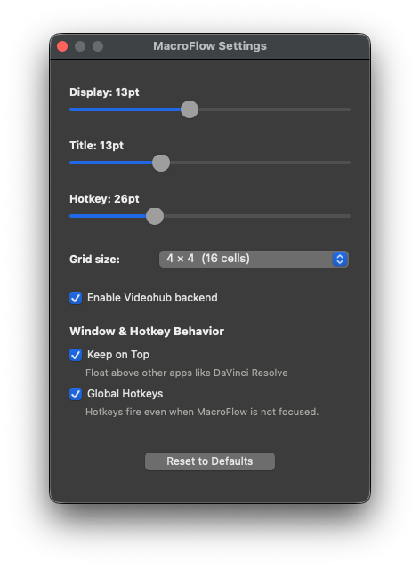

# MacroFlow

[](https://github.com/chadlittlepage/MacroFlow/actions/workflows/ci.yml)
[](https://github.com/chadlittlepage/MacroFlow/actions/workflows/codeql.yml)
[](https://github.com/chadlittlepage/MacroFlow/actions/workflows/ci.yml)
[](https://github.com/astral-sh/ruff)
[](https://github.com/chadlittlepage/MacroFlow/releases/latest)
[](LICENSE)
[](https://www.apple.com/macos/)

**A clickable grid of macro buttons that automate DaVinci Resolve and
Blackmagic Videohub from one place.** Pick a Resolve quadrant for any
video track, recall a Videohub preset, fire from a hotkey or a click —
backends run in parallel, with live feedback on the timeline as you edit.



> **License notice.** MacroFlow is **source-available**, not open source.
> The code is published for transparency, portfolio review, and bug
> reporting. You may read, clone, and run it locally for personal
> evaluation. Redistribution, modification, derivative works, and
> commercial use require prior written permission. See [LICENSE](LICENSE)
> for the exact terms. **Support is best-effort.**

---

## Download

The latest signed + notarized `.dmg` is on the
[Releases page](https://github.com/chadlittlepage/MacroFlow/releases/latest).
Drag `MacroFlow.app` to `/Applications` (or `~/Applications`) and launch
— Gatekeeper accepts it directly.

| Requirement | Minimum |
|---|---|
| macOS | 14.0 (Sonoma) or later — tested on 14 + 15 (Sequoia) |
| DaVinci Resolve | Studio or free, running on the same Mac |
| Videohub Controller | Optional, used to author presets MacroFlow recalls |
| Python | Only for development; the signed `.app` ships its own |

---

## Overview

MacroFlow is a clickable grid of macro cells. Each cell fires one or
more backend actions in parallel from a single click, hotkey, or
keyboard nav.

- **Videohub** — recall a saved preset on a Blackmagic Videohub router.
- **DaVinci Resolve** — enable / disable a chosen subset of video tracks
  on the current timeline AND push per-track transforms (Quadrant, Zoom,
  Position, Rotation, Anchor, Pitch, Yaw, Flip H/V).

Each backend runs on its own worker thread, so a stuck Resolve call
never blocks a Videohub recall (or vice-versa).

## The Grid

Default grid: **4×4 (16 cells)**. Configurable in Settings up to
**40×40 (1600 cells)**.

| Action | Effect |
|---|---|
| **Click a cell** | Fire its macro AND mark it selected |
| **Right-click a cell** | Open the macro editor |
| **Cmd+Click / Ctrl+Click** | Open the macro editor |
| **Press a cell's hotkey** | Fire that cell from anywhere in the app |
| **Arrow ↑ / ↓ / ← / →** | Move the keyboard selection (left/right wrap) |
| **Return / Enter** | Fire the selected cell |
| **Cmd+E** | Edit the selected cell (Edit → Edit Macro…) |
| **Cmd+F** | Toggle native macOS full-screen |

The selected cell shows a **1px 60%-white outline + 1px black inset**.
Selection persists until another cell is selected.

### The top strip

A dark `#131313` strip across the top contains:

- **LCD message bar** — last action / hover description / errors.
- **Status indicators** — DAVINCI RESOLVE (left) + VIDEOHUB (right).
  VIDEOHUB hides when disabled in Settings.
- **Preset chooser** — snapshots of (rows, cols, all macros).

### Presets

A preset is a named snapshot of the entire grid (dimensions + every
macro). Use the popup + Save / Delete buttons in the top strip:

- **Save** — names a snapshot of the current grid. Suggests `Preset 1`,
  `Preset 2`…; saving over an existing name overwrites it.
- **Recall** — pick a preset from the popup → applies **instantly**.
  Resizes the grid if needed, replaces all macros wholesale, and turns
  Videohub ON or OFF to match the preset's needs (the popup labels presets
  that contain Videohub actions with `• uses Videohub`).
- **Delete** — removes the selected preset (Cmd+Z restores).

---

## The Macro Editor

Open with right-click, Cmd+Click, Ctrl+Click, or Cmd+E (after selecting).
The editor is non-modal, **floats over other apps** so DaVinci Resolve
can stay focused for live preview, and is **single-instance** — opening
for a different cell closes the previous editor instead of stacking
windows. Re-opening for the same cell brings the existing window forward.
◀ / ▶ at the top right step through every cell, autosaving as you go.



### Top section

| Field | What it does |
|---|---|
| **Label** | Free-text name shown on the cell |
| **Color** | sRGB color picker. The cell repaints in real time. A non-default color alone is enough to tint the cell. |
| **Hotkey** | Modifier dropdown (— / Cmd / Ctrl / Opt / Shift) + key dropdown (a–z, 0–9, F1–F12). Shown on the cell as ⌘1, ⌃A, ⌥F2, ⇧B. Hotkeys are suppressed while you're typing in any text field. |

### Videohub section

The header has a per-macro **Enable** checkbox. New macros default to OFF.
When unchecked, Device + Preset show "Disabled" and grey out. Tick it to
include Videohub in this macro:

- **Device** — picks from Videohub Controller's saved devices.
- **Preset** — picks from that device's saved presets.

### DaVinci Resolve video tracks

**Timeline resolution** — A dropdown above the track list. The first
option auto-detects from Resolve and shows the value inline (e.g.
`Auto-detect (3840 × 2160 from Resolve)`). The remaining options pin
to common Resolve resolutions: HD 720p / HD 1080p / 2K DCI / UHD 4K /
DCI 4K / 5K / 6K DCI / UHD 8K / DCI 8K. The quadrant snap-offsets are
computed from this value, so for a 4K timeline Q2 lands at
`(+1920, +1080)`; for 8K it's `(+3840, +2160)`. Use the override when
Resolve's API returns the wrong value (compound clips and nested
timelines on macOS 15 sometimes report 1920×1080 for an 8K timeline).
The choice persists across sessions and is mirrored in
**Settings → Timeline**.

Track list (left pane, draggable divider) lists tracks descending —
`Vn` at the top, `V1` at the bottom — to match Resolve's timeline.

**Keyboard while focused on the track list:**

| Key | Effect |
|---|---|
| ↑ / ↓ | Move the row selection |
| Enter / Return | Toggle the selected track's enabled flag |
| ← / → | Step the selected track's quadrant Q1 → Q2 → Q3 → Q4 |

**Per-track detail panel (right pane):**

| Control | Effect |
|---|---|
| **Enable track** | Mirrors the row's leading "✓ " |
| **Quadrant** | Q1 / Q2 / Q3 / Q4. Picking a quadrant auto-snaps Position X/Y to (±tl_w/2, ±tl_h/2) for the active timeline — for a 4K timeline that's `(±1920, ±1080)`. The quadrant is the single source of truth. |
| **Transform fields** | Zoom X/Y, Position X/Y, Rotation, Anchor X/Y, Pitch, Yaw. **Click + drag to scrub** any field — drag right increases, drag left decreases. Plain click without drag → enters edit mode. Double-click → enters edit mode immediately. |
| **Flip H / Flip V** | Flip the track horizontally / vertically |
| **Live update Resolve** | Default ON. When unchecked, edits in the editor stay in the editor and don't push to Resolve. Useful for building a preset against a running project without disturbing it. |
| **Reset Selected** | Restore the selected track to the values captured from Resolve when the editor opened |
| **Reset All Tracks** | Same, applied to every track |
| **Quad preview (2×2)** | Click any quadrant in the preview to set it |

**Drag-scrub sensitivity:**

| Field | Per pixel |
|---|---|
| Zoom X/Y | 0.01 |
| Position X/Y, Anchor X/Y | 1.0 |
| Rotation, Pitch, Yaw | 0.5 |

### Live preview in Resolve

While the editor is open AND **Live update Resolve** is on (default),
EVERY change pushes to Resolve so you see it on the timeline immediately:

- Pick a quadrant (popup, preview click, or ←/→ on the track table) →
  position auto-snaps and the full transform pushes
- Toggle Flip H / Flip V → push
- Toggle Enable track (or Enter on the track table) → push
- Edit a transform field then Tab / Enter / focus-out → push
- Drag-scrub a transform field → field updates live; pushes on mouse-up
  (so the Fusion bridge isn't flooded mid-drag)
- Reset Selected / Reset All Tracks → pushes the captured values back

### Autosave + playhead-aware writes

**Autosave** — every macro mutation (label, color, hotkey, Videohub
device/preset, quadrant pick, flip toggle, transform field, track-enable
check, drag-scrub mouse-up, Clear Macro) is persisted to
`macroflow.json` ~300 ms after your last edit. The **Save** button
still works — it's a "save now" force-flush rather than the only path
to disk. Closing the editor without Save is safe.

**Playhead-aware** — transforms apply to (and read back from) the clip
**currently under the playhead** on each track, NOT the leftmost clip.
If V1 has multiple clips (NINJAV, a compound, color bars, …) and
you're parked on the compound, the compound is what MacroFlow writes
to. If the playhead is in dead space on a track, that track is silently
skipped — leftmost clips never get accidentally re-positioned.

### Clear Macro

The **Clear Macro** button at the bottom-left of the editor wipes the
current cell's macro (label, color, hotkey, Videohub action, all
per-track transforms) after a confirmation dialog. Cmd+Z restores it.

### Copy / Paste macros

| Shortcut | Effect |
|---|---|
| Click a cell, then **Cmd+C** (or Edit > Copy) | Copies the entire macro — label, color, hotkey, Videohub action, every per-track transform |
| Click another cell, then **Cmd+V** (or Edit > Paste) | Pastes onto that cell. Cmd+Z undoes the paste |

When focus is in a text field, Cmd+C / Cmd+V work as standard text
edit copy/paste — no interference.

### Quit-restore

On launch, MacroFlow snapshots the Resolve project's track enable flags
and per-track transforms. On Cmd+Q / menu Quit, those values are pushed
back, undoing any changes MacroFlow made during the session. Force-quit
(`kill -9`, crash) bypasses the restore hook.

---

## Settings



`Cmd+,` opens Settings:

- **Display / Title / Hotkey** font size sliders. Display and Title go
  up to 40 pt; Hotkey goes up to 60 pt. Drag to live-adjust the grid;
  saves are debounced 250 ms after the last drag tick. The LCD strip
  auto-grows so the display font stays vertically centered, and the
  status row + grid push down rather than overlap.
- **Reset to Defaults** — restores 12 / 13 / 26 pt font sizes (undoable).
- **Reset All** — destructive nuke: every macro, every preset, and
  every setting back to defaults. Confirmation dialog asks first, NO
  undo. Use **Export Settings…** first if you want a recovery file.
- **Grid size** — 4×4, 6×6, 8×8, 10×10, 12×12, 20×20, 40×40. Live-resize
  without restart. Macros at out-of-bounds coordinates are kept in
  storage and reappear if you grow the grid back.
- **Timeline** — resolution override that drives the editor's quadrant
  math. Auto-detect (default), HD, 2K DCI, UHD 4K, DCI 4K, UHD 8K, DCI
  8K. Same dropdown is mirrored at the top of Edit Macro.
- **Enable Videohub backend** — master switch. When off: VIDEOHUB status
  indicator hides, the status probe is skipped, and recall short-circuits
  to no-op. The editor's Videohub fields can still be configured for
  later use.
- **Window & Hotkey Behavior** (ported from Videohub Controller):
  - **Keep on Top** — floats the MacroFlow window above other apps
    (DaVinci Resolve, etc.) using `NSFloatingWindowLevel`.
  - **Global Hotkeys** — macro hotkeys fire even when MacroFlow is not
    the focused app. **macOS 15+ requires both Accessibility AND Input
    Monitoring** permissions (System Settings → Privacy & Security →
    both lists). Pre-15 only needed Accessibility. The in-app prompt
    links to System Settings and tells you which lists to tick.

---

## Status indicators

| Indicator | What "green" actually means |
|---|---|
| **DAVINCI RESOLVE** | The Resolve scripting bridge round-trips a `GetProjectManager()` call (catches stale handles after Resolve quits mid-session). |
| **VIDEOHUB** | Videohub Controller is in the running-applications list (NSWorkspace bundle-id check). Doesn't depend on a router being on the LAN. |

Both probes re-run every 5 seconds, in worker threads so a slow probe
can't freeze the main UI.

## Hotkeys

Local NSEvent monitor — only fires while MacroFlow is the focused app
AND no text field has focus. Each macro can require an exact modifier:

- Macro requires **Cmd** → only `Cmd+key` fires it (`Ctrl+key` won't).
- Macro requires **no modifier** → only bare key fires it (`Cmd+key` won't).

Function keys F1–F12 are matched by keycode (no character resolution).

When **Global Hotkeys** is on, the same matching applies app-wide.
macOS routes events to LOCAL or GLOBAL monitor based on focus, never
both — no double-fire.

## Undo / Redo (Cmd+Z / Cmd+Shift+Z)

App-level undo stack (max 50 entries) covers:

- Settings → Grid size change
- Settings → Enable Videohub backend toggle
- Settings → Reset to Defaults (font sizes)
- Top-bar → Recall preset (full prior grid state)
- Top-bar → Delete preset
- Editor → Clear cell

NSText fields handle their own edit-undo before our Cmd+Z. Within-editor
transient edits (Reset Selected/All, drag-scrub) are not undoable —
closing the editor without Save naturally undoes them.

## Console (Help → Show Console, Cmd+Shift+C)

Live tail of every print / traceback the app emits. Use **Export…** to
write the buffer to a timestamped `.txt` — attach that file when
reporting a bug. Buffer holds the most recent 10,000 lines.

The full manual is also available in-app at **Help → MacroFlow Manual
(Cmd+?)**.

---

## File locations

| Path | Contents |
|---|---|
| `/Users/Shared/MacroFlow/macroflow.json` | Macro grid config (multi-user shared) |
| `/Users/Shared/Videohub Controller/videohub_controller.json` | Videohub presets (read-only from MacroFlow) |
| `/Library/Application Support/Blackmagic Design/.../DaVinciResolveScript.py` | Resolve scripting bridge (system-installed) |

The macro file is multi-user safe: parent dir is forced 0o777, file is
forced 0o666, writes are atomic via temp-file + `os.replace()`. Symlinks
at the target are NOT followed.

## JSON shape (`macroflow.json`)

```json
{
  "rows": 4, "cols": 4,
  "videohub_enabled": true,
  "keep_on_top": false,
  "global_hotkeys": false,
  "font_sizes": {"display": 12, "title": 13, "hotkey": 26},
  "timeline_resolution": "auto",
  "presets": { "Preset 1": {"rows": 4, "cols": 4, "macros": {…}} },
  "macros": {
    "0,0": {
      "id": "0,0", "label": "TEST 1", "color": "#a4a833",
      "hotkey": "1", "hotkey_modifier": "Cmd",
      "videohub_enabled": false,
      "videohub": {"device_id": "…", "preset_name": "1 Preset"},
      "resolve": {
        "tracks": {"1": true, "3": false},
        "track_transforms": {"1": {"quadrant": "Q2", "zoom_x": 1.0, …}},
        "track_names":      {"1": "Hero Cam"}
      }
    }
  }
}
```

`track_names` records the Resolve track name at save time. On load, the
editor prefers a name match over an idx match — so inserting / deleting
Resolve tracks (which shifts indices) leaves your saved transforms
attached to the correct physical track.

## Multi-user

Every user on the same Mac reads + writes the same shared config file
(`/Users/Shared/MacroFlow/macroflow.json`, `0o666`). Configure macros
on one account, log into another → same macros, settings, and presets
appear. Same applies to Videohub Controller's config.

## Export / Import / Reset All

| Action | Shortcut | What it does |
|---|---|---|
| **Export Settings…** | Cmd+Shift+E | Writes a verbatim copy of `macroflow.json` to a path you pick. Captures every macro, every preset, all settings, including `timeline_resolution`. |
| **Import Settings…** | Cmd+Shift+I | Atomic-writes the chosen `.json` over the live config and reloads in place. No restart required. |
| **Settings → Reset All** | — | Wipes every macro + every setting back to defaults. Confirmation dialog asks first; **NO undo**. |

Recommended workflow: **Export first, then Reset.** If you regret the
reset, Import restores everything byte-for-byte. The round-trip is
verified by an in-repo simulation that exercises a maximally-loaded
config through Save → Export → Reset → Import → reload and confirms
nothing is dropped.

---

## Development

```bash
git clone https://github.com/chadlittlepage/MacroFlow.git
cd MacroFlow
pip3 install -e .
PYTHONPATH=src python3 -m macroflow
```

## Build (signed + notarized)

```bash
./build_and_sign.sh
```

Output: `dist/MacroFlow.dmg` (signed, notarized, stapled).

The script auto-detects your Developer ID, builds via py2app, signs
with hardened runtime + entitlements, notarizes via the
`chads-davinci-notary` keychain profile (configurable via
`NOTARY_PROFILE` env var), staples, and packages a DMG.

## Project structure

```
MacroFlow/
├── src/macroflow/
│   ├── app.py                Main Cocoa grid window + AppController
│   ├── macro.py              Macro / MacroGrid / MacroStore data model
│   ├── macro_editor.py       Per-cell editor (track list, transforms, quad preview)
│   ├── settings_window.py    Settings dialog (sliders + grid size + behavior toggles)
│   ├── about_window.py       About panel
│   ├── help_window.py        In-app manual
│   ├── console_window.py     Live stdout/stderr capture + export
│   ├── log_capture.py        Stdout/stderr tee → ring buffer + observers
│   ├── quad_preview.py       2×2 quad-view monitor (clickable)
│   └── backends/
│       ├── videohub.py       Reads VHC config, drives TCP recall
│       ├── resolve.py        DaVinciResolveScript wrapper
│       └── local_dimming.py  LocalDimmingSim Fusion-macro toggle
├── tests/                    pytest suite
├── docs/screenshots/         README assets
├── assets/AppIcon.iconset/   App icon source PNGs
├── assets/AppIcon.icns       Compiled app icon
├── app_entry.py              py2app entry point
├── setup.py                  py2app config
├── pyproject.toml            project metadata + lint config
├── entitlements.plist        Hardened-runtime entitlements
├── build_and_sign.sh         Build + sign + notarize + DMG
└── dmg_settings.py           dmgbuild config
```

---

## Reporting bugs

1. Open Help → Show Console.
2. Reproduce the issue.
3. Click Export… and save the log.
4. Open an issue on GitHub and attach the log, with a one-line
   description of what you did and what you expected.

## Author

**Chad Littlepage**
[chad.littlepage@gmail.com](mailto:chad.littlepage@gmail.com) · 323.974.0444

## License

Source-Available, all rights reserved. Read [LICENSE](LICENSE) before
forking, redistributing, or using in any commercial product.
